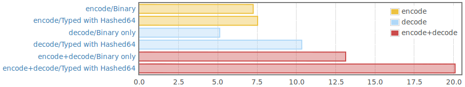

[][travis]

# Typed Binary lib

Standard `Binary` serializes to `ByteString`, which is an untyped format;
deserialization of unexpected input usually results in unusable data.

This module is built around a `Typed` type, which allows serializing both a
value and the type of that value; deserialization can then check whether the
received data was sent assuming the right type, and error messages may provide
insight into the type mismatch.

This package serves the same purpose as [tagged-binary][tagged-binary], with
a couple of key differences:

- Support of different kinds of serialized type annotations, each with
  specific strengths and weaknesses.

- Error messages can provide details on type errors at the cost of
  longer message lengths to include the necessary information.

- Serialization computationally almost as efficient as "Data.Binary" when
  precaching type representations; decoding however is slower.
  These values obviously depend a lot on the involved data and its type;
  an example benchmark is shown in the picture below.

- No depencency on `Internal` modules of other libraries, and a very small
  dependency footprint in general.

For information about usage, see the `Tutorial` submodule.

Performance-wise, here is a value `Right (Left <100 chars lipsum>)` of
type `Either (Char, Int) (Either String (Maybe Integer))` benchmarked
using the `Hashed` type representation:

More information can be found on the [binary-typed Hackage page][hackage], or
you can generate the documentation yourself (via `cabal haddock`).

[travis]: https://travis-ci.org/quchen/binary-typed
[hackage]: http://hackage.haskell.org/package/binary-typed
[tagged-binary]: http://hackage.haskell.org/package/tagged-binary